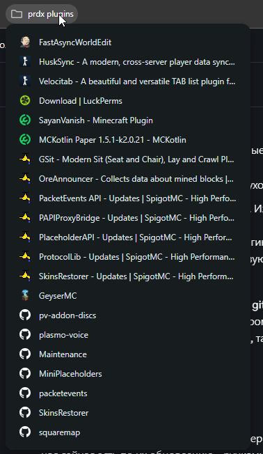

# CI/CD Плагинов

Логика деплоя новых плагинов и их версий базируется на принципах из [ci-cd-servisov.md](ci-cd-servisov.md "mention").

## GitOps

Имеем несколько репозиториев для каждого environment'а:

* `rp-plugins`
* `crp-plugins`
* `gca-plugins`
* и другие

Каждый репозиторий разделен на основные ветки:

* `main` – Основная ветка. Изменения уходят на прод.
* `dev` – Ветка открытого тестирования. Изменения уходят на дев.

В репозиториях хранятся сбилдженые плагины. Они сгруппированы по папкам для миров (overworld, farmworld, nether, ...). Плагины, присутствующие на сервере глобально и имеющие одинаковые конфиги, лежат в директории `shared`.&#x20;

Каждый из репозиториев привязан через `git-sync (который, кстати, не так легко настроить)` в свою директорию на машине, которая смонтирована внутрь контейнера с сервером. Он подхватывает изменения и переносит их на машину. Какая ветка получила изменение, такая машина и подхватила.

## Обновление плагинов

Большое количество плагинов на наших серверах не самописные, и единственний способ обновления – ручками проверять GitHub репозитории, страницы на [Modrinth](https://modrinth.com) или ждать анонса новой версии платных плагинов в Discord серверах.




## Самописные плагины

Все самописные плагины при пуше в `dev` автоматически билдятся в GitHub Actions и выдают на выходе готовые `.jar` файлы на `Paper` и `Velocity`.

До принятия решения об адекватном пайплайне плагинов, Хаффку в лс прилетала большая ссылка от Апехума на выполненный workflow, у которого в артефактах лежал 5-и мегабайтный `.jar` файл:

<figure><figcaption></figcaption></figure>

Каждый раз заходить в локальный клон `rp-plugins`, ручками переносить в каждый мир новый  плагин, удалять старую версию, коммитить, пушить и ждать 1 минуту пока `git-sync` сделает свое дело очень надоело:

<figure><figcaption></figcaption></figure>

А ведь так запускались не только бета версии, но и версии для простого тестирования впроцессе разработки.

Тогда мы написали наш первый GitHub Action: `digitaldrugstech/mc-plugin-update@main` и код билд-н-деплоя в наших плагинах стал выглядеть опрятней:

<details>

<summary>Workflow плагина на чат</summary>


```yaml
name: Build and Deploy Plugin

on:
  push:
    branches:
      - dev
      - feat/**
      - fix/**

jobs:
  build:
    runs-on: self-hosted
    name: Build Plugin
    outputs:
      paper_artifact: ${{ steps.upload_paper.outputs.artifact_path }}
      velocity_artifact: ${{ steps.upload_velocity.outputs.artifact_path }}
    steps:
      - name: Checkout Plugin Code
        uses: actions/checkout@v4
        with:
          token: ${{ secrets.TOKEN }}
          submodules: recursive

      - name: Set up JDK
        uses: actions/setup-java@v4
        with:
          distribution: temurin
          java-version: 21

      - name: Setup Gradle
        uses: gradle/actions/setup-gradle@v3

      - name: Build Plugin
        run: ./gradlew velocity:build paper:build -Psnapshot=true -PdigitaldrugsPrivateUsername=${{ secrets.MAVEN_REPO_USERNAME }} -PdigitaldrugsPrivatePassword=${{ secrets.MAVEN_REPO_PASSWORD }}

      - name: Upload Paper Artifact
        id: upload_paper
        uses: actions/upload-artifact@v4
        with:
          name: murchat-paper
          path: paper/build/libs/*.jar

      - name: Upload Velocity Artifact
        id: upload_velocity
        uses: actions/upload-artifact@v4
        with:
          name: murchat-velocity
          path: velocity/build/libs/*.jar

  deploy:
    needs: build
    runs-on: self-hosted
    strategy:
      max-parallel: 1
      matrix:
        include:
          # Survival Environment
          - environment: RP
            repo: "digitaldrugstech/rp-plugins"
            path: "proxy/plugins"
            artifact: "murchat-velocity"
            plugin_name: "MurChat*.jar"

          - environment: RP
            repo: "digitaldrugstech/rp-plugins"
            path: "shared/plugins"
            artifact: "murchat-paper"
            plugin_name: "MurChat*.jar"

          # Creative Environment
          - environment: CRP
            repo: "digitaldrugstech/crp-plugins"
            path: "proxy/plugins"
            artifact: "murchat-velocity"
            plugin_name: "MurChat*.jar"

          - environment: CRP
            repo: "digitaldrugstech/crp-plugins"
            path: "build/plugins"
            artifact: "murchat-paper"
            plugin_name: "MurChat*.jar"

    steps:
      - name: Deploy Plugin
        uses: digitaldrugstech/mc-plugin-updater@main
        with:
          environment: ${{ matrix.environment }}
          repo: ${{ matrix.repo }}
          path: ${{ matrix.path }}
          artifact: ${{ matrix.artifact }}
          plugin_name: ${{ matrix.plugin_name }}
          token: ${{ secrets.TOKEN }}

  cleanup:
    needs: deploy
    runs-on: self-hosted
    name: Delete artifacts
    steps:
      - name: Delete Paper Artifact
        uses: GeekyEggo/delete-artifact@v5.1.0
        with:
          name: murchat-paper
      - name: Delete Velocity Artifact
        uses: GeekyEggo/delete-artifact@v5.1.0
        with:
          name: murchat-velocity

  notify:
    needs: deploy
    runs-on: self-hosted
    name: Send Discord Notification
    steps:
      - name: Discord Notification
        uses: appleboy/discord-action@master
        with:
          webhook_id: ${{ secrets.DISCORD_WEBHOOK_ID }}
          webhook_token: ${{ secrets.DISCORD_WEBHOOK_TOKEN }}
          message: |
            **Updated MurChat**
            New version uploaded to dev server

            || GH SHA: ${{ github.sha }} ||
          username: GitHub Actions
          avatar_url: https://github.githubassets.com/images/modules/logos_page/GitHub-Mark.png
```


</details>

Как итог, мы получили красивый workflow который при пуше билдит плагин, загружает его на все нужные сервера и отправляет в Discord уведомление о заливе новой версии (пока что только по sha, потому что в плагинах еще не настроено версионирование).

<figure><figcaption><p>Полностью выполненный workflow run в плагине на чат</p></figcaption></figure>

<figure><figcaption><p>Алерты о выходе новых версиях в дискорде PRDXSOTECH</p></figcaption></figure>

<figure><figcaption><p>Автоматизированные коммиты в rp-plugins</p></figcaption></figure>

## Динамические конфиги

Большинство значений в конфигах могут отличаться в зависимости от того где этот конфиг используется: на проде или деве, в мире ферм или мире построек, поэтому мы используем встроенное в `docker-minecraft` форматирование конфигов через `ENV`.

Подробнее почитать можно тут: [https://docker-minecraft-server.readthedocs.io/en/latest/configuration/interpolating/#replacing-variables-inside-configs](https://docker-minecraft-server.readthedocs.io/en/latest/configuration/interpolating/#replacing-variables-inside-configs)

Отличный пример на конфиге `CoreProtect`:

<figure><figcaption><p>Использование ENV параметров в конфигах</p></figcaption></figure>

`CoreProtect` и его конфиги должны быть на всех серверах кроме прокси, поэтому он хранится в папке `shared`.

Добавлять данные от БД в конфиг на GitHub не только небезопасно, но и работать не будет: на проде и деве пароли разные, поэтому в конфиге мы используем динамические, но общие на весь env параметры для подключения БД: `CFG_MYSQL_HOST`, `CFG_MYSQL_USER`

Чтобы разные сервера не перемешивались в БД корпротекта, плагин просит называть базы данных уникально, и тут нам на помощь приходит значение `CFG_SERVER_NAME`, которое уникально для каждого сервера: в мире построек в конфиге будет написано `mysql-database: mc_overworld`, в мире ферм – `:mc_farmworld,` а в энде –  :`mc_the-end` – и всё, сервера пользуются общим конфигом!

